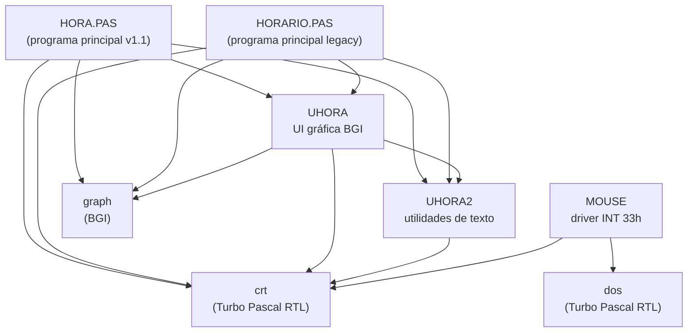
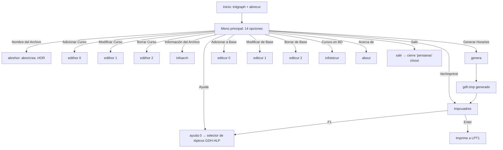
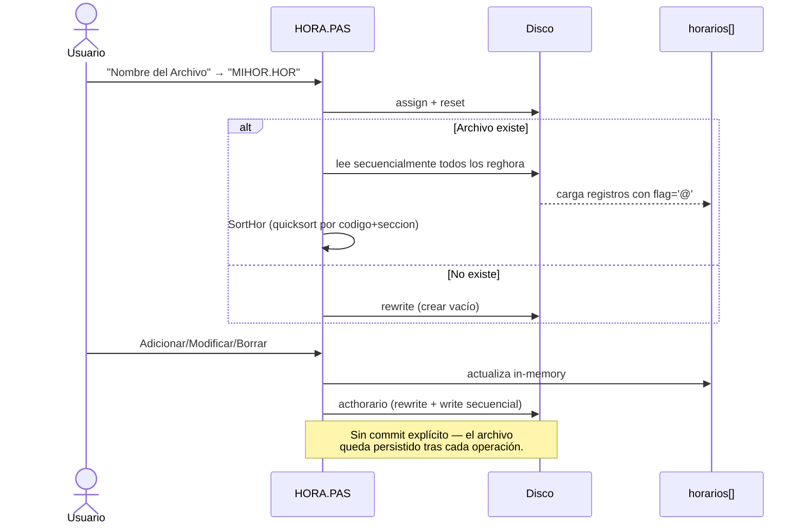

# Arquitectura

Documentación moderna de la estructura del programa basada en el código
real de [src/](../src/) (snapshot HORA11, abril 1996).

## Mapa de módulos



> **Nota:** `MOUSE` está presente en BETA96 y HORA11 pero **no está enlazada
> en la cláusula `uses`** del `HORA.PAS` final — es código de soporte que el
> autor mantuvo disponible pero no llegó a integrar al menú interactivo. El
> programa funciona enteramente con teclado.

## Programas vs. unidades

| Archivo | Tipo | Rol |
|---|---|---|
| [src/HORA.PAS](../src/HORA.PAS) | `program` | **Main v1.1** (abr 1996, modo gráfico) |
| [src/HORARIO.PAS](../src/HORARIO.PAS) | `program` | Main legacy (v1.0, coexiste con HORA.PAS) |
| [src/UHORA.PAS](../src/UHORA.PAS) | `unit uhora` | Widgets gráficos: ventanas, botones, listas, msgbox, formularios |
| [src/UHORA2.PAS](../src/UHORA2.PAS) | `unit uhora2` | Utilidades estilo dBase: `alltrim`, `upper`, `numval`, `strval`, `left`, `right`, `beep` |
| [src/MOUSE.PAS](../src/MOUSE.PAS) | `unit Mouse` | Driver de ratón vía `intr(51, regs)` con cursores personalizados |

Ver detalles por unidad en [docs/codigo/](codigo/).

## Capa de presentación

Todo se renderiza en **modo gráfico VGA 640×480** vía la unidad `graph` de
Turbo Pascal (driver BGI EGAVGA.BGI).

Layout fijo del programa principal (ver `procedure refresh` en
[src/HORA.PAS](../src/HORA.PAS)):

```
┌──────────────────────────────────────────────────────────┐
│ Generador de Horarios                       [barra superior]│
├─────────────────┬────────────────────────────────────────┤
│                 │ ┌─ Archivo Abierto ────────────────────┐│
│  Menú General   │ │  Archivo en uso: PRUEBA.HOR          ││
│                 │ └──────────────────────────────────────┘│
│ ► Nombre del    │ ┌─ Información ────────────────────────┐│
│   Archivo       │ │                                      ││
│  Adicionar      │ │  (panel dinámico según opción)       ││
│   Curso         │ │                                      ││
│  Modificar/     │ │                                      ││
│   Verificar     │ │                                      ││
│  Borrar Curso   │ │                                      ││
│  Información    │ │                                      ││
│   del Archivo   │ │                                      ││
│  Generar        │ │                                      ││
│   Horarios      │ │                                      ││
│   Posibles      │ │                                      ││
│  Ver/Imprimir   │ │                                      ││
│  Adicionar...   │ │                                      ││
│  Modificar...   │ │                                      ││
│  Borrar...      │ │                                      ││
│  Cursos en BD   │ │                                      ││
│  Ayuda          │ │                                      ││
│  Acerca de...   │ │                                      ││
│  Salir          │ └──────────────────────────────────────┘│
└─────────────────┴────────────────────────────────────────┘
```

- Panel izquierdo: **14 botones de menú** estáticos (`mn[1..14]`).
- Panel superior derecho: estado del archivo abierto.
- Panel inferior derecho: contenido dinámico (info, formularios, tablas).
- Diálogos modales (`msgbox`, `selectitem`, `gettext`, `tabla`) flotan encima
  guardando/restaurando el área de pantalla con `getimg/putimg`.

## Modelo de datos (en memoria)

```pascal
type
  mathora  = array[1..24] of integer;     { 12 pares (fila, columna) — hasta 12 hrs }

  regcur   = record                       { Curso de la base de datos }
    codigo:  string[5];
    nombre:  string[12];
    ht:      integer;                     { horas totales por semana }
    flag:    char;                        { '@' = activo, otro = borrado lógico }
  end;

  reghora  = record                       { Sección de un curso en el horario }
    codigo:   string[5];
    seccion:  string[4];
    profesor: string[8];
    flag:     char;
    hora:     mathora;
  end;

  regcuadre = record                      { Combinación válida (horario sin cruces) }
    seccion: array[1..16] of string[5];   { 15 secciones + '@' sentinel }
  end;
```

| Estructura | Capacidad en RAM | Persistencia |
|---|---|---|
| `cursos: array[1..500] of regcur` | 500 cursos | `CURSOS.DAT` (`file of regcur`) |
| `horarios: array[1..375] of reghora` | 375 secciones | `<nombre>.HOR` (`file of reghora`) |
| `cuadres: file of regcuadre` | — (en disco) | `gdh.tmp` (temporal, se reescribe en cada `genera`) |

Detalles binarios completos en [FORMATO-DATOS.md](FORMATO-DATOS.md).

## Flujo principal



## Algoritmo de generación (`procedure genera`)

Enumeración combinatoria iterativa, no recursiva. Está en
[src/HORA.PAS](../src/HORA.PAS) y funciona así:

1. **Filtra cursos seleccionados** (vía `selectitem` con multi-select).
2. **Agrupa secciones por curso** en `curtemp[1..15, 1..25]`, llevando un
   contador `max[i]` por curso.
3. **Permite marcar horas no deseadas** (`vaciohor[15,6]`, modo `tabla(2)`).
4. **Contador multi-base:** mantiene `top[1..totcur]` como dígitos donde
   `top[i] ∈ [1..max[i]]`. Incrementa el último, propaga el carry hacia el
   más significativo. Termina cuando `top[1] > max[1]`.
5. Para cada combinación, **construye `table[15,6]`** partiendo de `vaciohor`
   (horas bloqueadas) y marca las horas de cada sección elegida. Si alguna
   celda ya estaba marcada → `cruce := true` y se descarta.
6. Las combinaciones sin cruce se escriben a `gdh.tmp` (`file of regcuadre`,
   96 bytes/registro). El primer registro guarda los **códigos de curso**
   terminados por `'@'`.
7. Reporta: posibles, con cruce, total de combinaciones, total de horas no
   deseadas y tamaño del temporal.

**Complejidad:** $O(\prod_{i=1}^{totcur} max[i])$ combinaciones, cada una con
trabajo lineal en horas marcadas. El benchmark del autor (en `GDH.HLP`):
≈ 1 000 combinaciones/segundo en un 486DLC a 40 MHz con SMARTDRV.

## Ciclo de vida de un archivo `.HOR`



El programa **no usa el flag `'@'` para borrado lógico durante la sesión**
— al borrar, comprime el array RAM moviendo `horarios[totreghor]` al hueco
y decrementa el contador. El flag se preserva al re-escribir.

## Decisiones de diseño notables

- **Sin estructuras dinámicas:** todos los arrays son estáticos (`array[1..N]`).
  Es típico de Pascal pre-FPC para evitar leaks y simplificar la gestión de
  memoria (el programa solo usa `getmem/freemem` en `getimg/putimg`).
- **Carga total en RAM:** los archivos `.HOR` y `CURSOS.DAT` se cargan
  completos al abrir. La operación `acthorario` reescribe todo en disco.
  Aceptable porque el máximo absoluto son ~33 KB de datos (375 × 69 + 500 × 22).
- **Quicksort manual** en lugar de RTL — la unidad de Turbo Pascal no
  incluía `sort`. Hay un `QSort` anidado en `SortCursos` y otro en `SortHor`.
- **Manejo de I/O con `{$I-} … IOResult <> 0`**: idiomatic Turbo Pascal pre-excepciones.
- **`{$M 65520, 0, 655360}`**: stack 64 KB, heap min=0, heap max=640 KB
  (el máximo posible en MS-DOS real mode).
- **Sin clases:** Pascal estructurado puro, sin `object` ni Turbo Vision.
- **Encoding CP850** en todo el código fuente (acentos y `ñ` literales en
  cadenas y comentarios).
